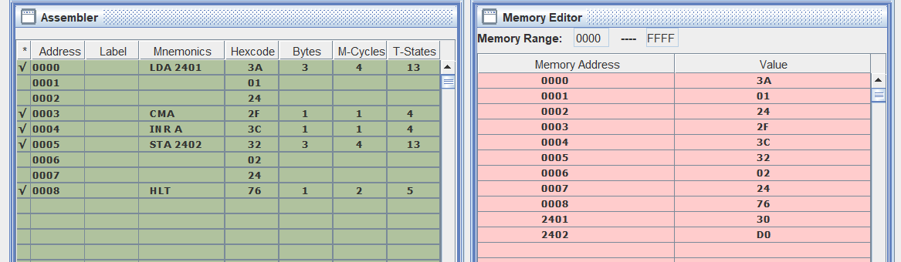

# Two's Complement of 8-bit Number

**Write an ALP to find 2’s complement of 8 bit number if the number is present in memory location 2401H.**

## Code

[Click Here for code](eightBitTwosComplement.asm)
