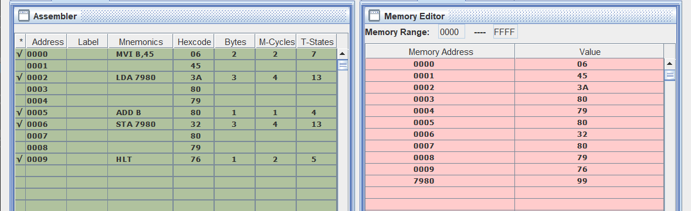

# Add Two 8-Bit Numbers

## 1- Directly Adding

**WAP to add two 8 bit numbers 55 H and 75H. Store 8 bit result in register C.**

### Code

[Click Here for code](addTwoEightBits.asm)

## 2- Add number stored in Memory Location with number stored in Registar

**Write a Program to add 8 bit number of register B with 8 bit number of memory location 7980H and store 8 bit result at the same location.**

### Code

[Click Here for code](addTwoEightBitsII.asm)