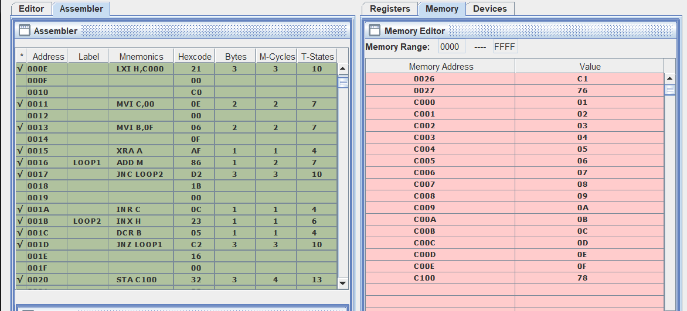

# Sum of Consecutive Series of Numbers

**Write an ALP to sum the given series of number 1+2+3+4……..+F. store the result at memory location C100H if series is present in memory location from C000H.**

## Code

[Click Here for code](consecutiveSeriesSum.asm)