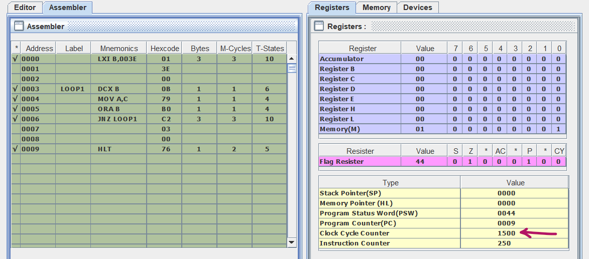

# Find Largest Number

**write a delay routine to produce a time delay of 0.5 MHZ in 8085 procesor-based-system whose is clock source is 6 MHz quartz crystal**

## Approach

1- clock frequency = 1/2 of crystal frequency => clock frequency = 3 (6/2) MHz
2- T = 1/clock frequency => T= 0.33 MHz
3- Now we need to find required T states to produce time delay 
   Required T states = time delay required / T
                     = 0.5 / 0.33 
                     = 1500
4- write the code for time delay 

5- Now how many times the loop should be iterated ?
   total T states = total T states before Loop
                    + [ (counter-1) * total T states in Loop when condition is true + Total T states in Loop when condition is false ]
                    + total T states after the Loop
   1500= 10 + (counter-1)*24 + 21 + 0
   counter= 61.2 or 62 (decimal)
   counter= 3E (Hexadecimal)

## Code

[Click Here for code ](timeDelay.asm)