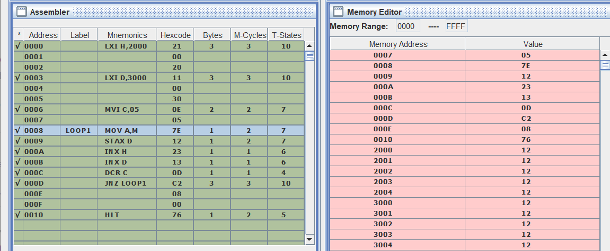

# Transfer Block of 5 Bytes from 1 Memory Location to Another

**Write an ALP (assembly language program) to transfer a block of 5 bytes from starting memory address 2000H to starting destination address 3000H.**

## Code

[Click Here for code ](transferFiveBytes.asm)